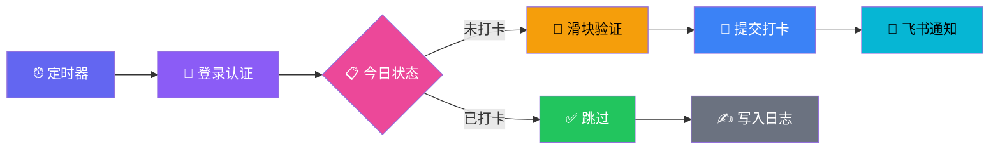

<p align="center">
  
</p>

<p align="center">
  
  
  
</p>

<p align="center">
  
  
  
  
</p>

---

```
  ╔══════════════════════════════════════════════════════╗
  ║                                                      ║
  ║   🏫  Sign In CST  ·  学生日常打卡  ·  自动签到      ║
  ║                                                      ║
  ║   模拟登录  →  绕过滑块验证  →  自动打卡  →  通知     ║
  ║                                                      ║
  ╚══════════════════════════════════════════════════════╝
```

## ✨ 特性

<table>
  <tr>
    <td width="50%">
      <h3>🔐 智能认证</h3>
      <p>自动完成学号密码登录，支持 Token 持久化与 HMAC-SHA256 请求签名</p>
    </td>
    <td width="50%">
      <h3>🧩 滑块绕过</h3>
      <p>拟人化轨迹生成算法，模拟真实鼠标拖拽行为，优雅绕过滑块验证码</p>
    </td>
  </tr>
  <tr>
    <td width="50%">
      <h3>⏰ 定时执行</h3>
      <p>集成 Windows 任务计划程序，每日 8:00 自动触发，无需人工干预</p>
    </td>
    <td width="50%">
      <h3>🔔 飞书通知</h3>
      <p>打卡结果实时推送至飞书群机器人，随时随地掌握执行状态</p>
    </td>
  </tr>
  <tr>
    <td width="50%">
      <h3>📋 完整日志</h3>
      <p>带时间戳的本地日志记录，每次执行过程可追溯、可审计</p>
    </td>
    <td width="50%">
      <h3>🛡️ 幂等保护</h3>
      <p>自动检测当日是否已打卡，避免重复提交，安全放心</p>
    </td>
  </tr>
</table>

## 🚀 快速开始

### 前置要求

- **Node.js** `>= 18.x`
- **Windows** `10 / 11`（定时任务依赖）
- **飞书机器人** Webhook 地址（可选，用于结果通知）

### 安装

```bash
# 1. 克隆仓库
git clone https://github.com/hxd77/Auto-check-in.git
cd Auto-check-in

# 2. 创建配置文件（请替换为你的实际信息）
echo { "student_no": "你的学号", "password": "你的密码" } > config.json

# 3. 手动测试运行
node checkin.js
```

### 配置定时任务

```powershell
# 以管理员身份打开 PowerShell，执行：
.\setup-scheduler.ps1
```

### 配置飞书通知（可选）

```bash
# 设置环境变量
export FEISHU_WEBHOOK_URL="https://open.feishu.cn/open-apis/bot/v2/hook/xxxxx"

# 测试通知
bash feishu-notify.sh
```

## 📐 架构



## 📂 项目结构

```
Auto-check-in/
├── checkin.js           # 🎯 核心打卡脚本（Node.js）
├── checkin.bat          # 🪟 Windows 批处理快捷入口
├── setup-scheduler.ps1  # ⏰ 定时任务一键部署
├── feishu-notify.sh     # 🔔 飞书机器人通知
├── config.json          # ⚙️  账号配置（不入库）
├── CLAUDE.md            # 🤖 Claude Code 项目规则
├── checkin.log          # 📋 运行日志（不入库）
└── .gitignore           # 🛡️  敏感文件保护
```

## 🎮 脚本详解

### `checkin.js` — 核心引擎

| 模块 | 功能 |
|------|------|
| `loadConfig()` | 加载 `config.json` 中的学号密码 |
| `request()` | 封装 HTTPS 请求，自动处理 Token & HMAC 签名 |
| `generateTrajectories()` | 生成 50~80 个拟人化鼠标轨迹点 |
| `main()` | 编排完整流程：登录 → 查状态 → 滑块 → 打卡 |

### 滑块轨迹模拟原理

```
位移
 ↑
 │        ╭──────────────────────╮
 │      ╭╯                      ╰╮
 │    ╭╯                          ╰╮
 │  ╭╯                              ╰╮
 │╭╯                                  ╰────
 └────────────────────────────────────────→ 时间

  加速段    匀速段         减速段
  (缓入)   (线性滑动)     (缓出)
```

算法使用 **三段式缓动函数** 模拟真人拖拽：慢启动 → 匀速滑动 → 慢停止，每个点加入 ±3px 随机抖动。

## 🔧 config.json 格式

```json
{
  "student_no": "2025XXXXX",
  "password": "your_password"
}
```

> ⚠️ `config.json` 包含明文密码，已通过 `.gitignore` 排除。切勿提交到仓库。

## 📊 运行日志示例

```
[2026/5/3 08:00:01] ========== 自动打卡开始 ==========
[2026/5/3 08:00:02] 登录成功: 张三 (student)
[2026/5/3 08:00:04] 打卡成功: 2026-05-03 08:00:03
```

## 🎨 技术栈

<p align="center">
  
</p>

## ⭐ 致谢

如果这个项目帮到了你，不妨点个 Star ⭐

<p align="center">
  <a href="https://github.com/hxd77/Auto-check-in">
    
  </a>
</p>

---

<p align="center">
  <sub>Made with ❤️ for students who value their sleep</sub>
  <br>
  <sub>© 2026 Auto Check-In · MIT License</sub>
</p>
